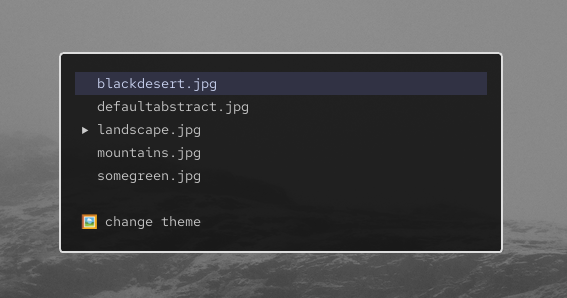

# fwall



FWall is a simple script for **Hyprland** users, allowing you to easily pick wallpapers and themes with keyboard shortcuts. Using **fuzzel** and **swww** to provide a seamless desktop experience.  
> Default keybinding - SUPER + N

---

## Installing

Run the following command in your terminal to download and install fwall:

```bash
bash <(curl -sL https://raw.githubusercontent.com/flrlart/fwall/main/install.sh)
```

---

## Uninstall
1. Remove keybinding from `~/.config/hypr/userprefs.conf`
2. Delete folder `~/.config/fwall`
